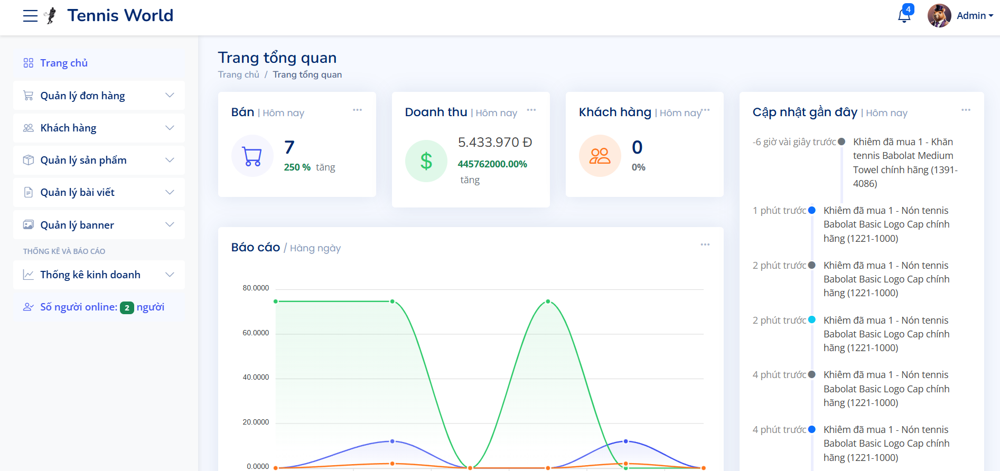

# Tennis Accessories Sales System (TASS)

A web-based application built with ASP.NET Core and React to streamline tennis accessory retail operations. TASS supports online ordering, inventory management, purchase order tracking, and a blog section for tennis news and training content. Developed as part of the SE109 course at UIT by Group 5.

---

## Project Roles and Features

### 🏸 Customer Role
- **Browse & Order**: View product catalog, filter by category/price, add to cart, and checkout via VNPay/MoMo/ZaloPay.  
- **Order Tracking**: Monitor order status in real time and review past orders.  
- **Reviews & Feedback**: Rate products and leave comments.

### 🔧 Sales Staff Role
- **Purchase Orders**: Create, modify, or cancel purchase orders; inventory auto-updates upon receipt.  
- **Sales Order Processing**: Confirm, ship, or cancel customer orders; update payment and delivery status; send email/SMS notifications.  
- **Reporting**: View PO history; export purchase reports (CSV/PDF/Excel).

### 🛠️ Admin Role
- **Catalog Management**: Create/update/delete categories and products (images, descriptions, stock levels).  
- **Inventory Reporting**: Generate/export stock reports (in/out, closing balance); view sales trends and low-stock dashboards.  
- **Blog & SEO**: Create/edit/delete blog posts, moderate comments, optimize with meta-tags/keywords.

### 📝 Blog Section

TASS includes a built-in blogging module to share tennis news, tips, and announcements:

- **Create/Edit/Delete Posts**: Admins can use the Admin Dashboard to manage blog entries, including title, rich-text content, featured image, and publication date.  
- **Comment Moderation**: Customers can leave comments on posts; admins can approve or delete comments to prevent spam.  
- **SEO Settings**: Each post supports custom meta-tags (title, description, keywords) and category assignment for better discoverability.  
- **Frontend Display**: Customers see a “Blog” link in the main navigation. They can browse post listings by category, view full articles, and leave feedback.

---

## Demo Screenshots

<small>_These images are examples; replace with actual screenshots from your environment._</small>

#### 🖥️ Admin Dashboard  


#### 🏬 Product Listing (Customer)  


#### 🛒 Shopping Cart & Checkout  


#### 📝 Blog Page (Customer)  


#### 📊 Inventory Report (Admin)  


---

## Setup & Installation

### Prerequisites
- **Visual Studio 2022** or later (Community/Professional/Enterprise)  
- **.NET 8 SDK**  
- (Optional) **Docker** + **Docker Compose** for containerized deployment

### Installation Steps

1. **Clone the repository**  
   ```bash
   https://github.com/Marethy/Tennis_AspNet.git
   cd Tennis_AspNet
2. Run the App 

   ```bash
   dotnet restore
   dotnet run
   ```


---

## Contributions

Contributions are welcome! To contribute:

1. Fork this repository and create a new branch:

   ```bash
   git checkout -b feature/your-feature-name
   ```
2. Make your changes, commit, and push:

   ```bash
   git add .
   git commit -m "Add feature: Your feature description"
   git push origin feature/your-feature-name
   ```
3. Open a Pull Request describing your changes.
4. Ensure all existing tests pass and add new tests if you introduce new functionality.

Please follow the existing code style (SOLID principles, clean architecture) and write unit tests using xUnit (backend) or Jest (frontend) as needed.

---

## License

This project is licensed under the [MIT License](./LICENSE).

---

## Result

Waiting...
---